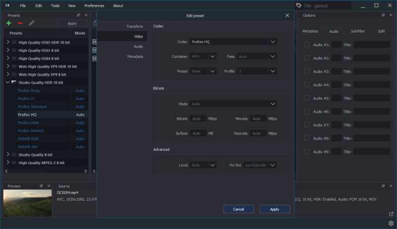

# Cine Encoder

Cine Encoder for Linux is an application that allows you to convert media files while preserving HDR signals. NVENC hardware encoding for NVIDIA video cards is also supported for H265 and H264 modes. The following encoding modes are implemented:

  - H265 NVENC (8, 10 bit)
  - H265 (8, 10 bit)
  - VP9 (10 bit)
  - AV1 (10 bit)
  - H264 NVENC (8 bit)
  - H264 (8 bit)
  - DNxHR HQX 4:2:2 (10 bit)
  - ProRes HQ 4:2:2 (10 bit)
  - ProRes 4444 4:4:4 (10 bit)




### Installation

Supported operating system: Linux x86_64

Make sure that the NVIDIA drivers are installed in accordance with the following requirements: [Using FFMPEG with NVIDIA.](https://docs.nvidia.com/video-technologies/video-codec-sdk/ffmpeg-with-nvidia-gpu/index.html)

##### - Arch Linux / Manjaro Linux:
  - install [AUR package](https://aur.archlinux.org/packages/cine-encoder/) or *.pkg.tar.xz file from release

  
### Buid instructions

Install dependencies:

    - ffmpeg>=4.2
    - mkvtoolnix>=49.0
    - libmediainfo>=20.03
    - qt5-base>=5.15

Buld package:

```sh
cd cine-encoder-(version)
make
```

### Licence

GNU GPL v.3
See [LICENSE.md](https://github.com/CineEncoder/CineEncoder/blob/master/LICENSE)


### Donate

If you wish to support this project, you can make a donation for $0.5 or more via PayPal. Your contributions will help keep the project alive and support future development.

[](https://paypal.me/KozhukharenkoOleg?locale.x=ru_RU)

##### Bitcoin
You can send bitcoins at this address or by scanning the QR code below:


1PqFt976YQTJ9Js3xym5GjtPDfsjq98kN8
